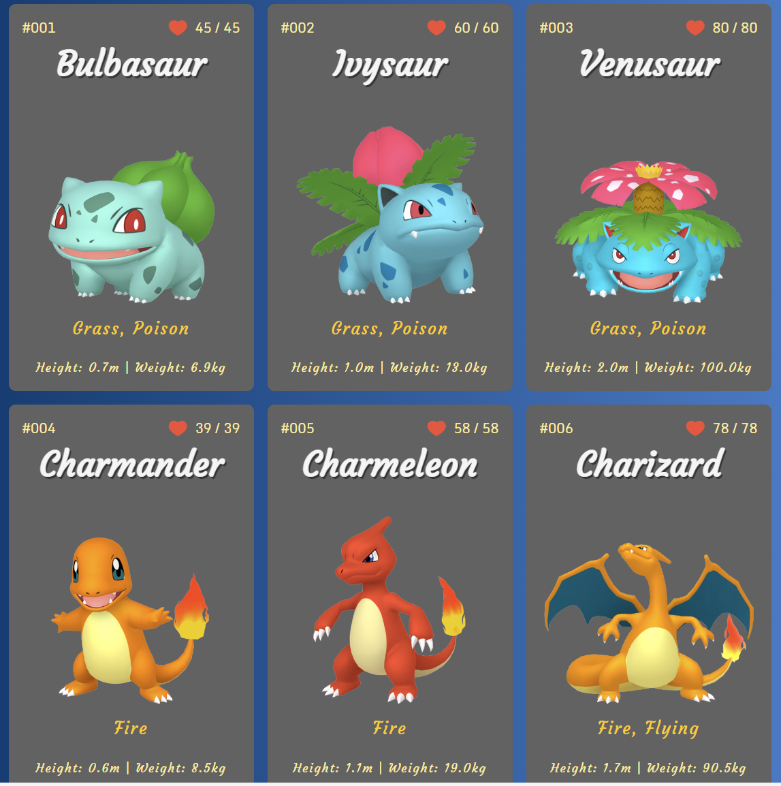

# PokeDetails
Pokedex like app for Pokemon

# Screenshot

My current take on utilizing the Pokemon API (https://pokeapi.co/). 

Right now, it is fetching the first 150 Pokemon and displaying them with their info in a CSS grid. The app also takes into consideration responsiveness. Depending on the device that it is used, the columns will change to properly fit the content.

Live Site URL: https://omerome83.github.io/PokeDetails
